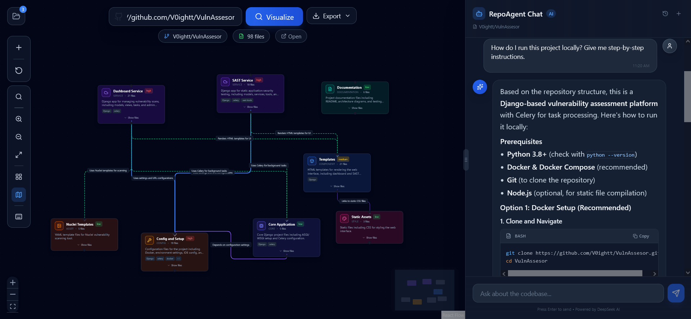
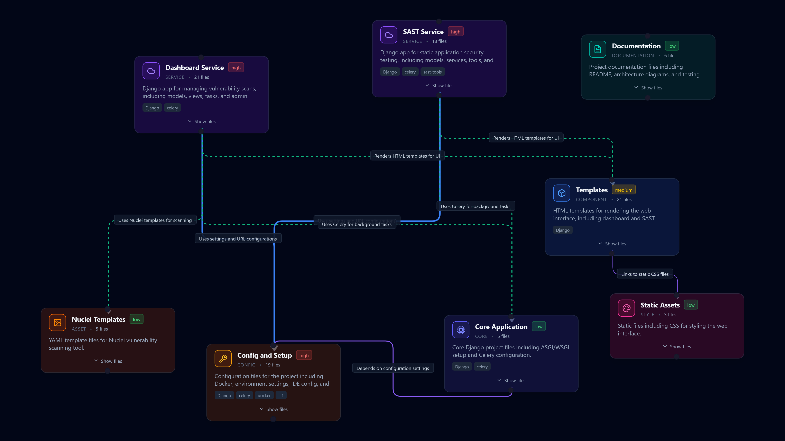

>[!NOTE]
>This project is under active development and has not entered the alpha stage yet. Features and functionality may change rapidly.

>[!IMPORTANT]
>Latest Updates:
>Improved AI prompts for better architecture understanding. Enhanced chatbot context awareness.

# Rassam Agent

[](https://discord.gg/fFtMjNQTFJ)
[](https://rassam.dev)

GitHub repository visualizer using Next.js, React Flow, and DeepSeek AI. Convert any GitHub repository into an interactive, intelligent flowchart. Ask questions about code structure and how to use the repository with an AI chatbot. (Made with Claude Code)

<div align="center">
  <a href="https://rassam.dev" target="_blank"></a>
</div>

---

## Features

### Multiple Node Types
- **Category-based nodes**: API, Component, Database, Auth, Service, Hook, and more
- **Visual differentiation**: Each category has unique colors and icons
- **Compact & Enhanced views**: Different node styles for different use cases

<div align="center">
  
</div>

### Detailed Node Information
- **File listing**: Expandable file list inside each node with copy functionality
- **Complexity indicators**: Low/Medium/High complexity badges
- **Dependencies tracking**: Shows external package dependencies
- **Lines of code estimation**: Quick overview of component size

### Flowchart Editing
- **Add nodes**: Create new nodes with custom labels, descriptions, and categories
- **Edit nodes**: Modify existing node properties inline
- **Delete nodes**: Remove nodes and their connections
- **Create connections**: Draw edges between nodes by dragging
- **Undo support**: Revert recent changes


### Export Options
- **PNG Export**: High-quality image export
- **SVG Export**: Scalable vector graphics
- **JSON Export**: Full flowchart data for backup or import

<div align="center">
  
</div>

### AI-Powered Chatbot
- **Context-aware responses**: Understands the selected node's context
- **Markdown support**: Code blocks with syntax highlighting
- **File path formatting**: Special rendering for file references
- **Quick actions**: Pre-built prompts for common questions
- **Chat history**: Persistent conversation within session

### Quality of Life Features
- **Search nodes**: Filter nodes by name, description, or file paths
- **Minimap**: Bird's-eye view of the entire flowchart
- **Keyboard shortcuts**: Common actions accessible via keyboard
- **Layout options**: Top-to-bottom or Left-to-right layouts
- **Zoom controls**: Easy navigation of large flowcharts
- **Loading states**: Clear feedback during API operations
---
## Getting Started

1.  **Clone the repo**
2.  **Install dependencies**:
    ```bash
    npm install
    ```
3.  **Environment Variables**:
    Create a `.env.local` file:
    ```
    DEEPSEEK_API_KEY=your_key
    GITHUB_TOKEN=optional_token_for_rate_limits
    ```
4.  **Run Development Server**:
    ```bash
    npm run dev
    ```
5.  **Open Browser**:
    Navigate to `http://localhost:3000`
---
## Tech Stack

-   **Framework**: Next.js 16 (App Router)
-   **Language**: TypeScript
-   **Styling**: Tailwind CSS v4
-   **Visualization**: React Flow
-   **Layout Engine**: Dagre
-   **AI**: DeepSeek API (via OpenAI SDK)
-   **Icons**: Lucide React
-   **Markdown**: React Markdown + React Syntax Highlighter
-   **Export**: html-to-image

---

## ❤️ Special Thanks

-   **GitHub Student Pack**: Thanks to Github for their amazing Student Developer Pack!
-   **Anthropic**: This project was made with the help of **Claude Opus 4.5**.

## 📬 Contact

-   **Discord**: `v0ight_`
-   **LinkedIn**: [Momen Saeb](https://www.linkedin.com/in/momen-saeb-b88183283/)
-   **Mail**: `contact@rassam.dev`


